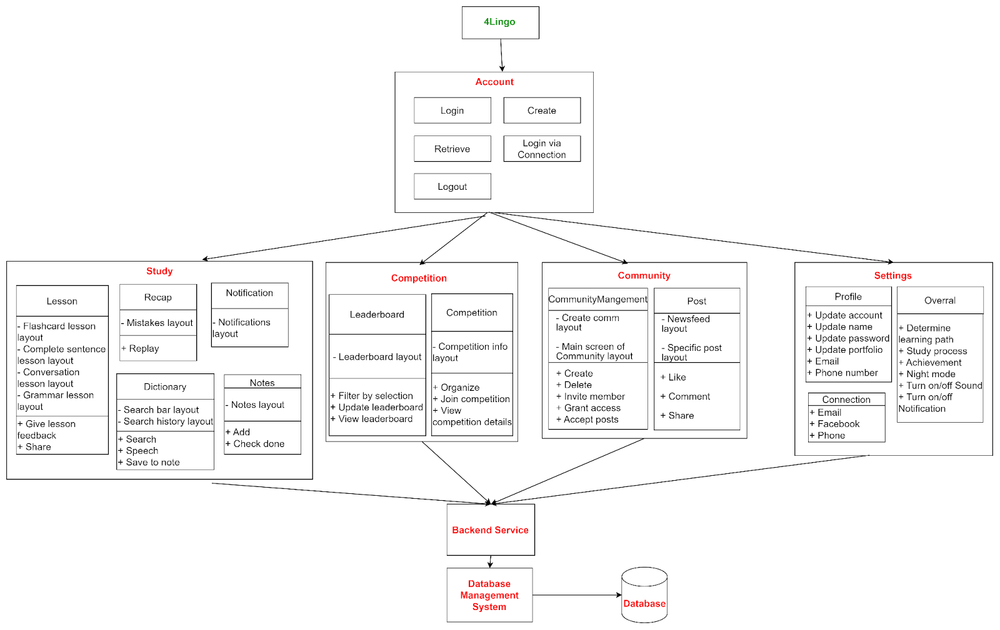

# 📱 Language Learning Mobile Application

This is an Android application designed to help users practice all four essential language skills: **listening**, **speaking**, **reading**, and **writing**.  
It also includes features for **learning vocabulary** through interactive exercises and structured lessons.

The app is developed using **Java** with **Android Studio** for the frontend, and **Python Flask** with **MySQL** for the backend API and data management.

You can [📄 View the project report (PDF)](report.pdf) or ▶️ [Watch demo video on YouTube](https://youtu.be/ByzojncIdvE?si=ypMQmS76E8vLIM8r)

## 🏗️ Architecture

The system follows a **three-tier architecture** consisting of:

- A mobile frontend built with **Android Studio (Java/XML)**
- A backend server built with **Python Flask**
- A **MySQL database** for persistent storage

### 📌 Overall System Architecture

<p align="center">
  
</p>

### 🖼️ System Tree

<p align="center">
  
</p>

---

### 📱 Frontend – Android (Java, XML)

The frontend is built using **Android Studio** with a clear separation between GUI, Controller, and Service layers:

- **GUI (Layouts, XML)**:  
  - Defines the structure and look of the UI (using XML Layouts)  
  - Handles dynamic UI updates based on user interaction  

- **Controller (Activity/Fragment)**:  
  - Manages the app's lifecycle and logic flow  
  - Formats user input and delegates tasks to Service layer  
  - Receives and handles responses for UI updates  

- **Service Layer**:  
  - Sends HTTP requests to the backend  
  - Processes responses and returns results to the Controller  

---

### 🔧 Backend – Flask (Python)

The backend follows a modular structure using the MVC pattern:

- **Controller (Routes)**:  
  - Handles HTTP routes and request parsing  
  - Delegates logic to the service layer

- **Service Layer**:  
  - Interacts with the database via **SQLAlchemy**  
  - Communicates with third-party APIs (if needed)  
  - Processes business logic and returns responses

---

### 🗄️ Database – MySQL

- Uses **MySQL** to store and manage structured data, including relationships between tables  
- **MySQL Workbench** is used to host and manage the local database schema


# ⚙️ Implementation

```bash
# 1. Clone the project
git clone https://github.com/your-username/your-repo.git

# 2. Create a virtual environment
py -m venv venv

# 3. Navigate to the server directory
cd 4lingo/server

# 4. Activate the virtual environment (on Windows)
.\venv\Scripts\activate

# 5. Install required dependencies
pip install -r requirements.txt

# 6. Set up MySQL database manually via MySQL Workbench:
#    - Use configuration in: server/config/config.py
#    - Run SQL script: server/database/queries/init.sql
#    - Make sure the DB is running and connected

# 7. Start the backend server
python server.py

# 8. Run the mobile app in Android Studio
#    - Open the 'client' folder
#    - Build and run on an emulator or real device
