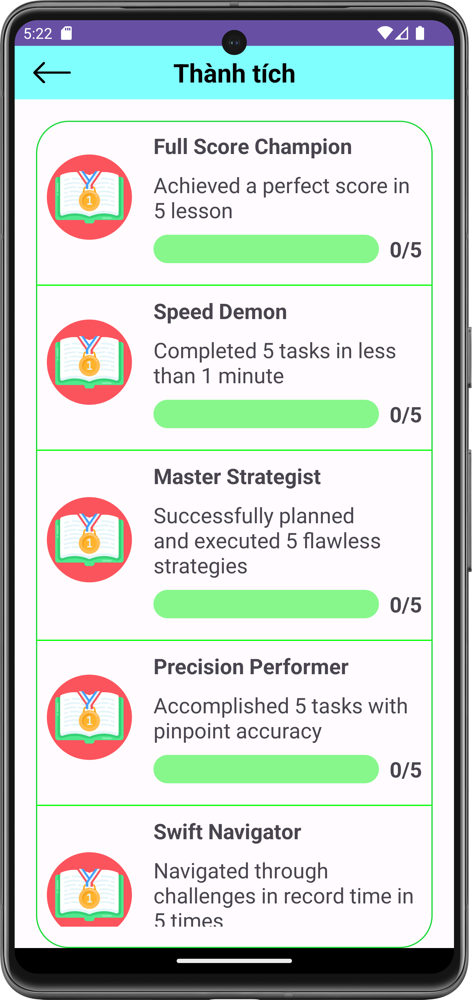

# 📱 Language Learning Mobile Application (4lingo)

This is an Android application designed to help users practice all four essential language skills: **listening**, **speaking**, **reading**, and **writing**.  
It also includes features for **learning vocabulary** through interactive exercises and structured lessons.

The app is developed using **Java** with **Android Studio** for the frontend, and **Python Flask** with **MySQL** for the backend API and data management.

You can [📄 View the project report (PDF)](report.pdf) or ▶️ [Watch demo video on YouTube](https://youtu.be/ByzojncIdvE?si=ypMQmS76E8vLIM8r)

## 🛠️ Development Process

This project was developed over the course of a semester (4 months), following a standard software engineering workflow. The full process included:

- **Requirement analysis**: Understanding the problem and defining functional and non-functional requirements  
- **System design**: Planning the overall architecture, database schema, and application structure  
- **Implementation**: Developing the frontend (Android) and backend (Flask) components  
- **Testing**: Performing both unit and integration testing to ensure functionality and reliability  
- **Deployment**: Running and validating the system on real devices and local servers  
- **Evaluation & improvement**: Gathering feedback, fixing bugs, and improving usability  

All related reports and documentation can be found in the [`/process_report/`](process_report/) folder.


# 🏗️ Architecture

The application follows a **three-tier architecture** consisting of:

- A mobile frontend built with **Android Studio (Java/XML)**
- A backend server developed using **Python Flask**
- A **MySQL** relational database for persistent storage

---

### 📌 Overall System Architecture

The frontend includes a clean separation between UI, logic, and networking layers:

- **GUI (Layouts & XML)**: defines UI structure and style; dynamically updated on user interaction.
- **Controller (Activities/Fragments)**: manages app lifecycle, processes user input, calls service functions, and updates the UI based on backend responses.
- **Service layer**: sends HTTP requests to the backend and handles responses.

The backend is built with **Flask (Python)** following an MVC-like pattern:

- **Controllers (Routes)**: handle HTTP requests and route them to appropriate services.
- **Service layer**: processes logic, interacts with **SQLAlchemy**, and (optionally) external APIs.

The **MySQL database** is used to define tables, relationships, and store structured data. The schema is managed locally using **MySQL Workbench**.

<p align="center">
  
</p>

---

### 🖼️ System Tree

<p align="center">
  
</p>

### 🗃️ Database Design

The system uses a **relational database (MySQL)** to store user data, learning progress, lessons, contests, and other application resources.  
The design ensures referential integrity and supports efficient data queries for both the backend and client.

<p align="center">
  
</p>


# ✨ Features


## 👤 Account Management

The application provides a complete account management system, allowing users to securely log in, sign up, and recover their password.  
Users can also view and update personal information such as **name**, **phone number**, and **email** via the profile screen.

<table>
  <tr>
    <td align="center">
      <br/>
      <em>Profile</em>
    </td>
    <td align="center">
      <br/>
      <em>Login</em>
    </td>
    <td align="center">
      <br/>
      <em>Sign Up</em>
    </td>
    <td align="center">
      <br/>
      <em>Forgot Password</em>
    </td>
  </tr>
</table>


## 🧠 Learn Vocabulary

The app helps users build and retain vocabulary through two integrated tools:

- **Bilingual Dictionary**:  
  Users can look up English–Vietnamese word definitions, phonetic transcriptions, and save useful words to their personal vocabulary note for later review.

- **Vocabulary Note**:  
  When tapping a word, a pop-up shows its meaning and automatically adds it to the vocabulary list. Users can access this list from their profile and mark words as either **learned** or **not learned**, helping them track their progress.

<table>
  <tr>
    <td align="center">
      <br/>
      <em>Bilingual Dictionary</em>
    </td>
    <td align="center">
      <br/>
      <em>Vocabulary Note</em>
    </td>
  </tr>
</table>

## 📚 Four Lesson Types

The application offers four types of interactive learning exercises to help users reinforce vocabulary, sentence structure, and real-life conversations:

- **Word Matching**: Match a word to its correct meaning or synonym.
- **Multiple Choice Questions**: Choose the correct answer based on a given question.
- **Translation**: Select and arrange the given words to form the correct translated sentence.
- **Conversation**: Choose the correct dialogue that matches the context of a short story or conversation.

<table>
  <tr>
    <td align="center">
      <br/>
      <em>Word Matching</em>
    </td>
    <td align="center">
      <br/>
      <em>Multiple Choice</em>
    </td>
    <td align="center">
      <br/>
      <em>Translation</em>
    </td>
    <td align="center">
      <br/>
      <em>Conversation</em>
    </td>
  </tr>
</table>

## 🧩 Others

The application also includes various supporting features to increase motivation and engagement:

- **Achievements**:  
  Learners receive achievements upon completing lessons or participating in contests created by instructors or administrators.

- **Leaderboard**:  
  Users are ranked based on the total points they earn from lessons, fostering friendly competition and consistent learning.

- **Lesson Feedback**:  
  After each lesson, users can submit reviews by rating the lesson with stars and leaving written feedback to help improve content quality.

- **Contests**:  
  Authorized users and administrators can organize **private or public contests**. All users can browse available or ongoing contests to **register or follow**.

<table>
  <tr>
    <td align="center">
      <br/>
      <em>Achievements</em>
    </td>
    <td align="center">
      <br/>
      <em>Leaderboard</em>
    </td>
    <td align="center">
      <br/>
      <em>Lesson Feedback</em>
    </td>
    <td align="center">
      <br/>
      <em>Contest</em>
    </td>
  </tr>
</table>


# ⚙️ Implementation

```bash
# 1. Clone the project
git clone https://github.com/your-username/your-repo.git

# 2. Create a virtual environment
py -m venv venv

# 3. Navigate to the server directory
cd 4lingo/server

# 4. Activate the virtual environment (on Windows)
.\venv\Scripts\activate

# 5. Install required dependencies
pip install -r requirements.txt

# 6. Set up MySQL database manually via MySQL Workbench:
#    - Use configuration in: server/config/config.py
#    - Run SQL script: server/database/queries/init.sql
#    - Make sure the DB is running and connected

# 7. Start the backend server
python server.py

# 8. Run the mobile app in Android Studio
#    - Open the 'client' folder
#    - Build and run on an emulator or real device
